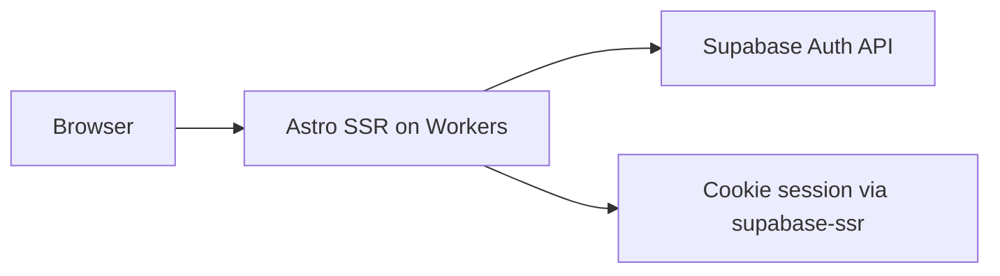

# Plan wdrożenia na Cloudflare (starter — bez nowych feature’ów)

## Zakres

**W scope:** wdrożenie **obecnego kodu** (landing, auth sign-in/up/out, `/dashboard`) na **Cloudflare Workers** z **Supabase Cloud** do auth.

**Poza scope (osobny plan / później):**
- Katalog, admin, CRUD, migracje domenowe Shelf (FR-002+)
- Cloudflare Queues / Workers Paid
- Jakiekolwiek nowe strony API poza istniejącym starterem

**Źródła decyzji:** [`context/foundation/tech-stack.md`](context/foundation/tech-stack.md), [`context/foundation/infrastructure.md`](context/foundation/infrastructure.md)

**Założenia (z wcześniejszej rozmowy):**
- Supabase: najpierw lokalnie do testów dev, **Supabase Cloud na produkcję**
- Deploy: **najpierw ręczny** (`wrangler deploy`), CI deploy **opcjonalnie na końcu**

---

## Stan wyjściowy

| Element | Plik | Stan |
|---------|------|------|
| Runtime | [`astro.config.mjs`](astro.config.mjs) | SSR + `@astrojs/cloudflare` |
| Worker config | [`wrangler.jsonc`](wrangler.jsonc) | `name: 10x-astro-starter` — do zmiany na `shelf` |
| Sekrety | [`astro.config.mjs`](astro.config.mjs) `env.schema` | `SUPABASE_URL`, `SUPABASE_KEY` (server-only) |
| CI | [`.github/workflows/ci.yml`](.github/workflows/ci.yml) | lint + build; **brak deploy** |
| Auth | [`src/pages/api/auth/*`](src/pages/api/auth/signin.ts), [`middleware.ts`](src/middleware.ts) | Działa przy skonfigurowanym Supabase |
| Baza | [`README.md`](README.md) | Tylko `auth.users` — **migracje nie są wymagane** do deploy startera |

**Platforma docelowa:** Cloudflare **Workers** (nie legacy Pages-only) — zgodnie z [`infrastructure.md`](context/foundation/infrastructure.md) i entrypointem `@astrojs/cloudflare/entrypoints/server` w [`wrangler.jsonc`](wrangler.jsonc).

---

## Architektura (tylko to, co jest dziś)



Brak kolejek, brak własnych tabel — tylko auth starter.

---

## Faza 0 — Weryfikacja lokalna

**Cel:** upewnić się, że build przechodzi i auth działa przed dotknięciem chmury.

1. **Env lokalny**
   - `cp .env.example .dev.vars` (Cloudflare local dev)
   - Opcja A — Supabase Docker: `npx supabase start` → wklej URL + anon key do `.dev.vars` (patrz [`README.md`](README.md))
   - Opcja B — od razu Supabase Cloud dev: te same zmienne z dashboardu

2. **Smoke test**
   - `npm run dev` → `/auth/signup`, `/auth/signin`, `/dashboard`
   - `npm run lint && npm run build` (tak jak CI)

3. **Minimalna poprawka konfiguracyjna (opcjonalna, nie feature)**
   - [`wrangler.jsonc`](wrangler.jsonc): `"name": "shelf"`
   - Sync docs: w [`context/foundation/tech-stack.md`](context/foundation/tech-stack.md) `deployment_target` → `cloudflare-workers` (usuwa drift z infrastructure.md)

**Exit criteria:** build OK; logowanie działa lokalnie z `.dev.vars`.

---

## Faza 1 — Przygotowanie Cloudflare

**Cel:** konto i CLI gotowe do pierwszego deployu.

1. Konto Cloudflare (free tier wystarczy na SSR starter — bez Queues)
2. `npx wrangler login`
3. Sprawdź [`wrangler.jsonc`](wrangler.jsonc):
   - `main`: `@astrojs/cloudflare/entrypoints/server` (już OK)
   - `compatibility_flags`: `nodejs_compat` (już OK)
   - `observability.enabled`: true (logi w dashboardzie)

**Exit criteria:** `wrangler whoami` działa.

---

## Faza 2 — Supabase Cloud (produkcja)

**Cel:** auth działa na wdrożonym Workerze (inny origin niż localhost).

1. Utwórz projekt w [Supabase Dashboard](https://supabase.com/dashboard)
2. **Settings → API:** skopiuj `Project URL` i `anon` public key
3. **Authentication → URL Configuration:**
   - **Site URL:** `https://shelf.<twoje-konto>.workers.dev` (lub custom domain po deployu)
   - **Redirect URLs:** dodaj URL Worker’a + `/auth/**` jeśli wymagane przez flow
4. **Email confirmation:** dla MVP możesz wyłączyć confirm email (jak w README dla local) alostawić włączone i testować z prawdziwym mailem
5. **GitHub secrets** (dla istniejącego CI build):
   - `SUPABASE_URL`, `SUPABASE_KEY` — wartości **prod** (build Astro embeduje/env wymaga ich przy `npm run build`)

**Exit criteria:** masz prod URL + anon key; redirect URLs obejmują docelowy Worker URL.

---

## Faza 3 — Ręczny deploy produkcyjny

**Cel:** starter live na Cloudflare Workers.

1. **Secrets runtime** (Worker — osobno od GitHub):
   ```bash
   npx wrangler secret put SUPABASE_URL
   npx wrangler secret put SUPABASE_KEY
   ```

2. **Build i deploy**
   ```bash
   npm run build && npx wrangler deploy
   ```
   (Zgodnie z [`infrastructure.md`](context/foundation/infrastructure.md) i Astro 6 + adapter 13 — nie osobny legacy flow tylko `wrangler dev` na co dzień.)

3. **Weryfikacja prod** (checklist deploy, nie PRD Shelf):
   - [ ] Strona główna 200
   - [ ] Rejestracja + logowanie
   - [ ] `/dashboard` chroniony (redirect bez sesji)
   - [ ] Wylogowanie
   - [ ] `npx wrangler tail` — brak błędów env/auth
   - [ ] (Opcjonalnie) `npx wrangler rollback` — suchy test cofnięcia wersji

4. **Custom domain (opcjonalnie)**
   - Cloudflare dashboard → Worker → Custom domains
   - Zaktualizuj Supabase Site URL / Redirect URLs

**Exit criteria:** publiczny URL Worker’a; auth end-to-end na prod; sekrety tylko w Wrangler + GitHub (nie w repo).

---

## Faza 4 — CI deploy (opcjonalna, po udanym ręcznym deployu)

**Cel:** auto-deploy-on-merge z [`tech-stack.md`](context/foundation/tech-stack.md) (`ci_default_flow: auto-deploy-on-merge`).

Nowy plik `.github/workflows/deploy.yml`:

```yaml
name: Deploy

on:
  push:
    branches: [master]

jobs:
  deploy:
    runs-on: ubuntu-latest
    steps:
      - uses: actions/checkout@v4
      - uses: actions/setup-node@v4
        with:
          node-version: 22
          cache: npm
      - run: npm ci && npx astro sync && npm run build
        env:
          SUPABASE_URL: ${{ secrets.SUPABASE_URL }}
          SUPABASE_KEY: ${{ secrets.SUPABASE_KEY }}
      - run: npx wrangler deploy
        env:
          CLOUDFLARE_API_TOKEN: ${{ secrets.CLOUDFLARE_API_TOKEN }}
```

**Wymagania:**
- `CLOUDFLARE_API_TOKEN` — Edit Cloudflare Workers (Account + Zone jeśli custom domain)
- Istniejący [`ci.yml`](.github/workflows/ci.yml) zostaje jako gate PR (lint + build)

**Exit criteria:** push do `master` → automatyczny deploy; ten sam auth smoke test na prod URL.

---

## Ryzyka (tylko deploy startera)

| Ryzyko | Mitigacja |
|--------|-----------|
| Secrets tylko w GitHub, brak w Wrangler | Faza 3 krok 1 — runtime 500 bez Wrangler secrets |
| Supabase redirect URL ≠ Worker URL | Faza 2 — zaktualizuj po pierwszym `wrangler deploy` |
| Build OK w CI, runtime fail | `wrangler tail`; porównaj `.dev.vars` vs prod secrets |
| `tech-stack.md` mówi Pages, kod Workers | Traktuj Workers jako canonical ([`infrastructure.md`](context/foundation/infrastructure.md)) |

**Świadomie poza tym planem:** Queues, Workers Paid ($5/mies.), migracje Shelf — potrzebne dopiero przy implementacji FR-005+.

---

## Checklist „deploy done”

- [ ] Lokalnie: `npm run dev` + auth OK
- [ ] `npm run lint && npm run build` OK
- [ ] `wrangler.jsonc` → `name: shelf`
- [ ] Supabase Cloud: URL + anon key + redirect URLs
- [ ] `wrangler secret put` × 2
- [ ] `npm run build && npx wrangler deploy`
- [ ] Prod smoke: signup → signin → dashboard → signout
- [ ] (Opcjonalnie) CI deploy workflow

---

## Następny krok po akceptacji

Wykonanie **Fazy 0 → 3** (ręczny deploy). Faza 4 tylko jeśli chcesz CI od razu po pierwszym udanym deployu.

Implementacja Shelf (katalog, admin, CRUD) — **osobny plan**, po tym deployu.
